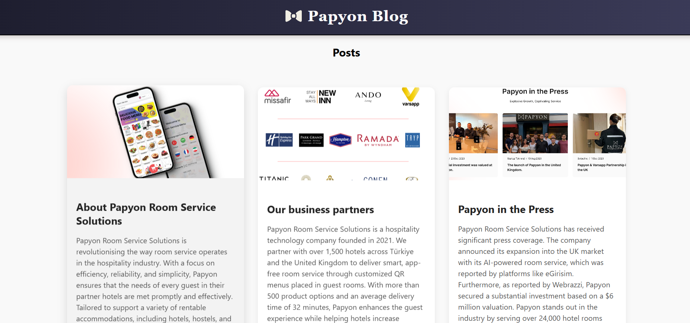
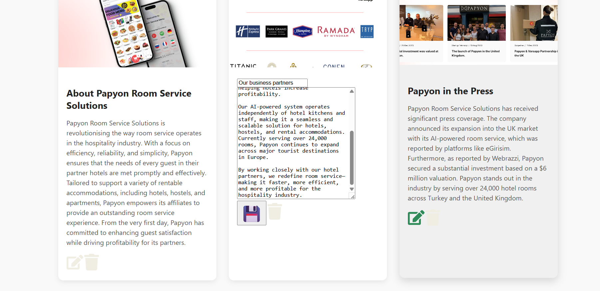

##  Türkçe Açıklama

# 🛎️ Papyon Room Service Dashboard

Bu proje, Papyon Room Service Solutions için geliştirilen bir içerik yönetim panelidir. JSON Server üzerinden alınan verileri listeleme, düzenleme ve silme işlemleri yapılabilir. React ve Axios kullanılarak oluşturulmuştur.

## Özellikler

- Tüm postları listeleme
- Post silme (ID bazlı)
- Post düzenleme (başlık ve içerik)
- Görsel destekli kart yapısı
- JSON Server ile mock API entegrasyonu
- Responsive ve kullanıcı dostu arayüz

## Kullanılan Teknolojiler

- React: UI oluşturmak için kullanılan JavaScript kütüphanesi
- Axios: API istekleri için HTTP istemcisi
- JSON Server: Mock veritabanı ve REST API
- React Icons: Silme ve düzenleme ikonları
- Vite: Hızlı geliştirme ortamı ve build sistemi

---
## English Description

# 🛎️ Papyon Room Service Dashboard

This project is a content management dashboard developed for Papyon Room Service Solutions. It allows listing, editing, and deleting posts fetched from a mock API using JSON Server. Built with React and Axios.

##  Features

- List all posts
- Delete posts by ID
- Edit post title and content
- Image-supported card layout
- Mock API integration with JSON Server
- Responsive and user-friendly interface

##  Technologies Used

- React: JavaScript library for building user interfaces
- Axios: HTTP client for API requests
- JSON Server: Mock database and REST API
- React Icons: Icons for delete and edit actions
- Vite: Fast development environment and build tool

  
