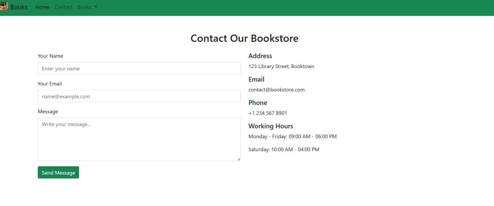

##  Türkçe Açıklama

#  Bootstrap Kitapçı Web Sitesi

Bu proje, HTML ve Bootstrap 5 kullanılarak oluşturulmuş basit ve duyarlı bir kitapçı web sitesidir. Ana sayfa, iletişim formu ve kitap detay sayfalarını içerir. Kullanıcılar iletişim kurabilir ve kitaplar hakkında yorum bırakabilir.

##  Sayfalar

- **Ana Sayfa (index.html)**  
  Diğer sayfalara yönlendiren gezinme çubuğu.

- **İletişim Sayfası (Contact.html)**  
  Kullanıcıların mesaj gönderebileceği iletişim formu. Adres, e-posta, telefon ve çalışma saatleri bilgileri içerir.

- **Kitap Detay Sayfası (book.html)**  
  Kitap bilgileri, görseli ve okuyucu yorumları bölümü yer alır.

##  Özellikler

- Bootstrap 5 ile duyarlı (responsive) tasarım
- Açılır menülü gezinme çubuğu
- Ad, e-posta ve mesaj alanları içeren iletişim formu
- Kitap görseli ve yorum formu içeren detay sayfası
- Örnek yorum listesi
- Temiz ve mobil uyumlu arayüz

##  Kullanılan Teknolojiler

- HTML5
- Bootstrap 5 (CDN üzerinden)
- Özel görseller (`picture/` klasöründe saklanır)
---
##  English Description

#  Bootstrap Bookstore Website

This is a simple and responsive bookstore website built with HTML and Bootstrap 5. It includes a homepage, contact form, and individual book detail pages with reader comments.

##  Pages Included

- **Home Page (index.html)**  
  Navigation bar with links to other pages.

- **Contact Page (Contact.html)**  
  Contact form for users to send messages. Includes address, email, phone, and working hours.

- **Book Detail Page (book1.html)**  
  Displays book information, image, and a comment section for readers.

## Features

- Responsive design using Bootstrap 5
- Navigation bar with dropdown menu
- Contact form with name, email, and message fields
- Book detail page with image and comment form
- Static comment list for demonstration
- Clean layout and mobile-friendly structure

##  Technologies Used

- HTML5
- Bootstrap 5 (via CDN)
- Custom images (stored in `picture/` folder)

.png>)  .png>) .png>)
