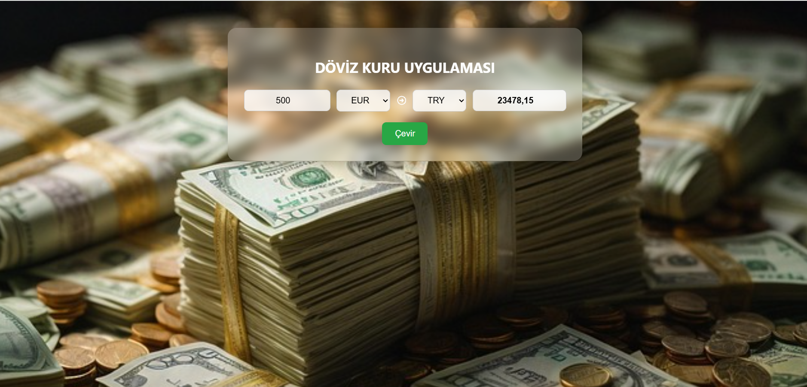

##  Türkçe Açıklama

#  Döviz Kuru Uygulaması

Bu React tabanlı uygulama, seçilen para birimleri arasında anlık döviz kuru hesaplaması yapar. Kullanıcı, miktarı ve para birimlerini seçerek güncel kur bilgisine göre dönüşüm sonucunu görebilir.

###  Özellikler

- Miktar girerek döviz dönüşümü yapma
- USD, EUR ve TRY arasında çeviri
- API üzerinden anlık kur verisi alma
- React Icons ile görsel yön okları
- Temiz ve kullanıcı dostu arayüz

###  Kullanılan Teknolojiler

- React: Bileşen tabanlı kullanıcı arayüzü
- Axios: API istekleri için HTTP istemcisi
- FreeCurrencyAPI: Döviz kuru verisi sağlayıcısı
- CSS: Özel stillendirme
- React Icons: Görsel ikonlar
---
## English Description

# Currency Exchange App

This React-based application allows users to calculate real-time currency conversions between selected currencies. Users can enter an amount and choose currencies to get the conversion result based on live exchange rates.

###  Features

- Convert entered amount between currencies
- Supports USD, EUR, and TRY
- Fetches live exchange rate data via API
- Visual arrow icons using React Icons
- Clean and user-friendly interface

###  Technologies Used

- React: Component-based user interface library
- Axios: HTTP client for API requests
- FreeCurrencyAPI: Currency data provider
- CSS: Custom styling
- React Icons: Visual icons

