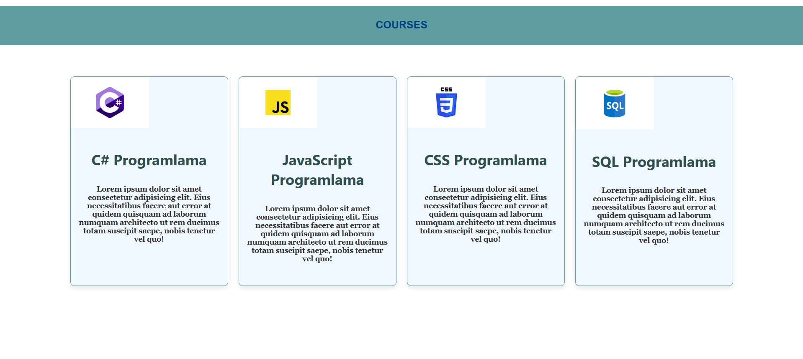

## 🇹🇷 React Kurslar Uygulaması

Bu proje, çeşitli programlama kurslarını görselleri ve açıklamalarıyla birlikte listeleyen basit bir React uygulamasıdır. Bileşen tabanlı yapısı sayesinde modüler ve düzenli bir kod mimarisi sunar.

###  Özellikler

- Kursları başlık, açıklama ve görsel ile listeleme
- Modüler bileşen yapısı (`Header`, `Course`)
- Özel CSS ile responsive tasarım
- Vite ile hızlı geliştirme ortamı

###  Kullanılan Teknolojiler

- React: Bileşen tabanlı kullanıcı arayüzü oluşturma
- Vite: Hızlı geliştirme ve build aracı
- CSS: Sayfa ve bileşen stilleri
- JavaScript (ES6+): Veri ve mantık yönetimi

###  Proje Yapısı

---
## 🇬🇧 English Description

#  React Courses Showcase

This is a simple React application that displays a list of programming courses with images and descriptions. The project uses modular components and static data to render a clean, responsive layout.

##  Features

- Displays multiple programming courses
- Each course includes a title, description, and image
- Modular component structure (`Header`, `Course`)
- Responsive layout with custom CSS
- Built with Vite for fast development

##  Technologies Used

- React: UI library for building components
- Vite: Fast build tool and development server
- CSS Modules: Custom styling for layout and components
- JavaScript (ES6+): Logic and data handling

##  Project Structure

