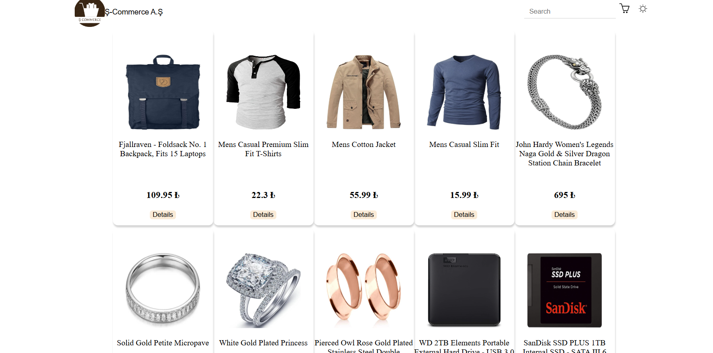
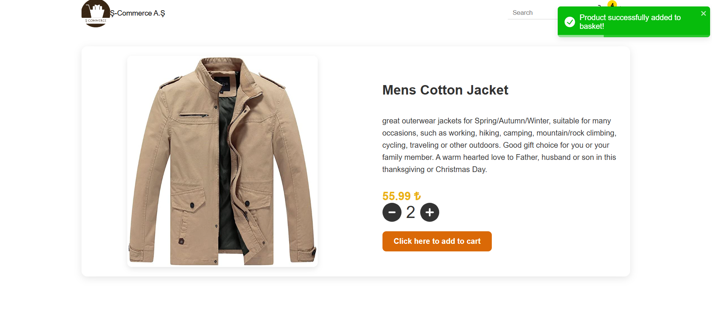
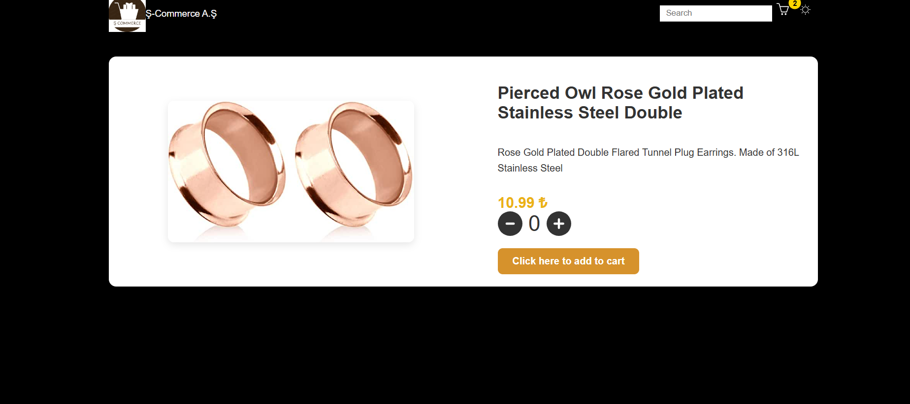
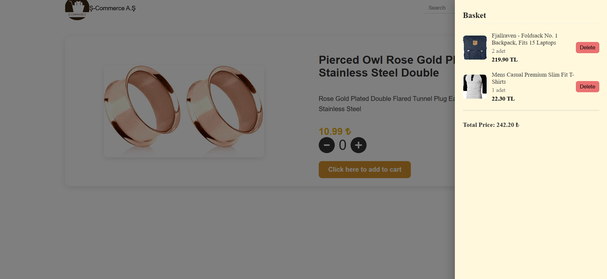

# 🛒 React E-commerce Cart App

This is a simple e-commerce cart application built with React and Redux Toolkit. Users can add products to the cart, remove them, and view the total price. Material UI is used for the user interface.

##  Features

- Product listing (from local JSON)
- Add products to cart
- View items in cart
- Remove items from cart
- Calculate total price
- Responsive design
- Cart display with Material UI Drawer

##  Technologies Used

- React
- Redux Toolkit
- React Router
- Material UI
- Toastify

