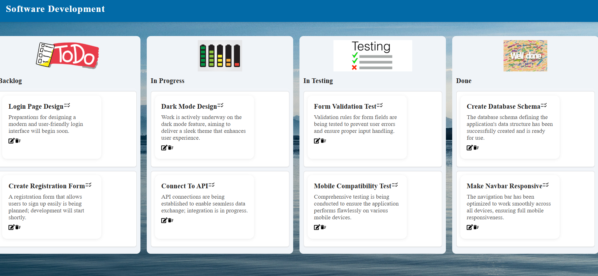
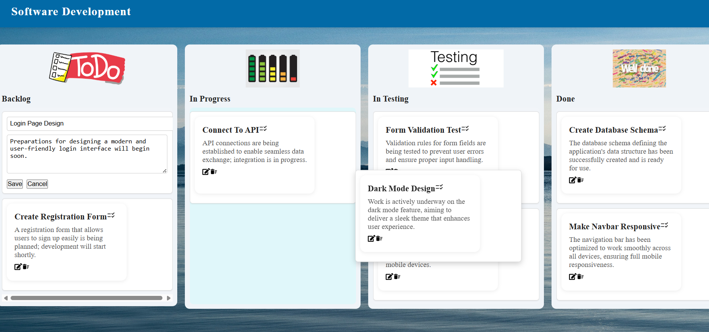
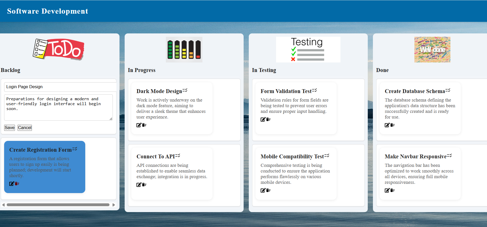

## 🇹🇷 FlowBoard – Kart Yönetimi
  
FlowBoard projesinin bu bölümü, kartları yönetir. Kartlar sürükle-bırak ile taşınabilir, düzenlenebilir ve silinebilir. `react-beautiful-dnd` ile etkileşimli yapı sağlanır, Axios ile JSON Server üzerinden veri işlemleri yapılır.

###  Özellikler

- Kartlar için sürükle-bırak desteği
- Inline düzenleme ve silme işlemleri
- Koşullu render ile düzenleme moduna geçiş
- Başlık ve görsel içeren SectionCard bileşeni
- Axios ile API üzerinden güncelleme ve silme
- Özel CSS ile responsive tasarım

###  Kullanılan Teknolojiler

- React
- react-beautiful-dnd
- Axios
- JSON Server
- Özel CSS
---
## 🇬🇧 FlowBoard – Card Management

This section of the FlowBoard project manages cards. Cards can be dragged and dropped, edited, and deleted. Interactive functionality is provided using `react-beautiful-dnd`, and data operations are handled via Axios and JSON Server.

### Features

- Drag-and-drop support for cards
- Inline editing and deletion
- Conditional rendering for edit mode
- SectionCard component with title and image
- API-based update and delete with Axios
- Responsive design with custom CSS

### Technologies Used

- React  
- react-beautiful-dnd  
- Axios  
- JSON Server  
- Custom CSS

   