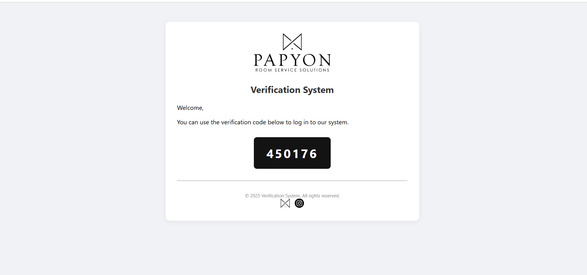
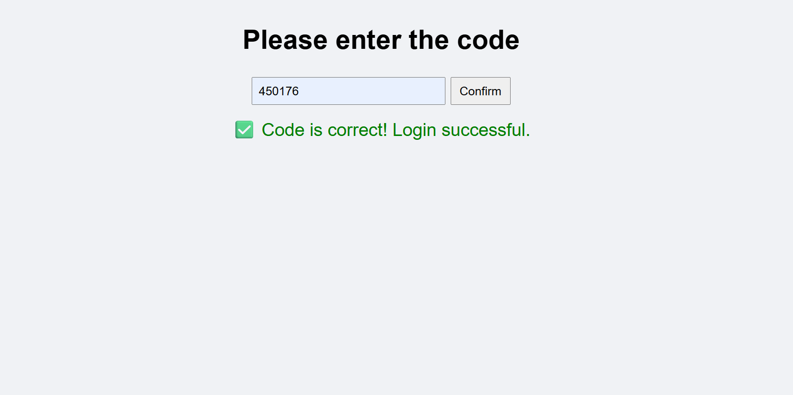

## 🇹🇷 Doğrulama Sistemi

Bu proje, kullanıcıların doğrulama kodu ile sisteme giriş yapmasını sağlayan basit bir web arayüzüdür. HTML, CSS ve JavaScript kullanılarak geliştirilmiştir. Kod, `localStorage` üzerinden kontrol edilir ve doğrulama sonucu ekranda gösterilir.

### Özellikler

- Kullanıcıya özel doğrulama kodu gösterimi  
- Kod giriş alanı ve onay butonu  
- Doğru/yanlış kod kontrolü  
- `localStorage` ile veri yönetimi  
- Responsive ve sade tasarım  
- Footer'da sosyal medya bağlantıları

### Kullanılan Teknolojiler

- HTML  
- CSS  
- JavaScript  
- localStorage API

---

## 🇬🇧  Verification System

This project provides a simple web interface for users to log in using a verification code. Built with HTML, CSS, and JavaScript, it checks the code via `localStorage` and displays the result on screen.

### Features

- Display of user-specific verification code  
- Input field and confirmation button  
- Code validation with success/failure feedback  
- Data management via `localStorage`  
- Responsive and clean design  
- Social media links in the footer

### Technologies Used

- HTML  
- CSS  
- JavaScript  
- localStorage API

